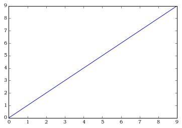

```python
import matplotlib.pyplot as plt
import numpy as np
%matplotlib inline
```


```python
x = np.arange(10)
plt.plot(x)
```


    [<matplotlib.lines.Line2D at 0x1101e9b90>]





```python

```


```python
ipython nbconvert --to markdown matplotlib-learning-guide.ipynb
```


      File "<ipython-input-8-a00502a62c29>", line 1
        ipython nbconvert --to markdown matplotlib-learning-guide.ipynb
                        ^
    SyntaxError: invalid syntax


```python

```
